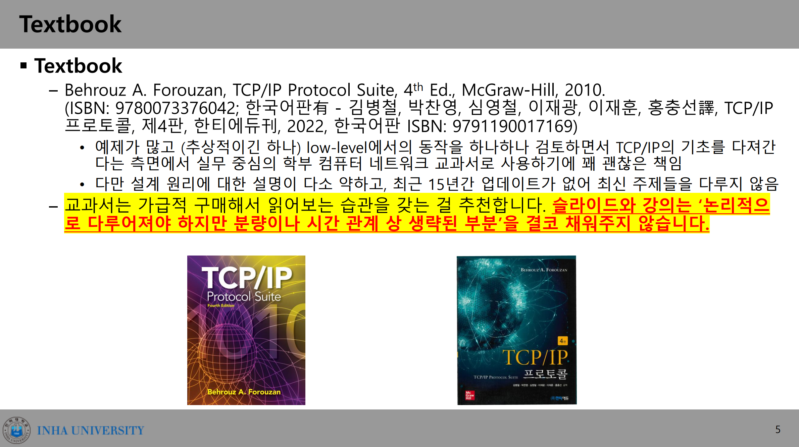

# 1일차

진행 상태: 완료
마감일: 2024년 9월 3일
프로젝트: 컴퓨터네트워크 (https://www.notion.so/2d6bee955a5c4c09bed3b29ca43a6b7e?pvs=21)

# 평가 계획

| 중간고사 | 40% |
| --- | --- |
| 기말고사 | 40% |
| 퀴즈 | 12% |
| 출석 | 4% |
| 숙제 | 4% |

# 교재

## 원서

[TCPIP Protocal Suite.pdf](TCPIP_Protocal_Suite.pdf)

## 국문

# What is a Network?

## 네트워크란?

두 개 이상의 entities 사이에서 정보를 교환하는 시스템

## Terms

### Node

PC, switch같은 정보 송수신의 주체와 객체들

### Link

nodes 사이의 connection