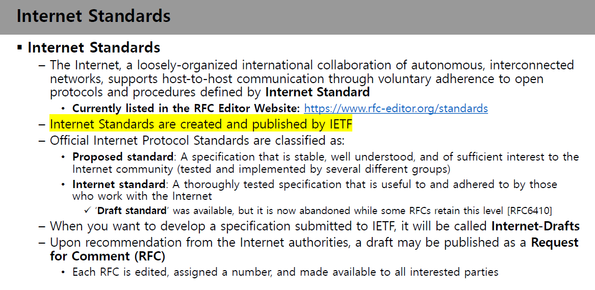

# 3일차

진행 상태: 보관
마감일: 2024년 9월 10일
프로젝트: 컴퓨터네트워크 (https://www.notion.so/2d6bee955a5c4c09bed3b29ca43a6b7e?pvs=21)

<aside>

# What is a Protocol?

</aside>

## Protocol의 사전적 의미: 의전

소통 방식과 절차에 대한 합의

## CS에서의 protocol

<aside>

**Protocol**

네트워크 방식

</aside>

## Protocol의 3요소

- 정처기 시험이나 면접 등에서 가끔 나온다고 한다
- 교수님께서는 왜 배워야 하는지 모르겠다고 말씀하신다

<aside>

### 1. Syntax

==format. **어떤 형태**로 데이터를 주고 받을 것인가?

### 2. Semantics

의미. → **의미에 대한 합의**

### 3. Timing

각 events가 일어나는 **순서**

</aside>

<aside>

# What is a Standard?

</aside>

## Standard란?

많은 방법들 중 **표준**이 되는 방법

## Standard Development Organization(SDO)

- 표준 개발 기구. 표준을 정한 기구
- IEEE, **IETF** 등등…
    - IETF는 우리가 네트워크 시간에 앞으로 배울 TCP standard를 만든 곳이라고 한다.

## De facto standards

<aside>

**De facto standards**

‘사실상’ 표준

</aside>

- 아주아주 광범위하게 사용되지만 모종의 이유로,,, 국제 표준이라고 공인되지는 않음
- internet standard, PDF 등이 여기에 포함된다.

<aside>

# Internet Standards

</aside>

- 이 부분 놓침 !! !! !!

> Internet Standards
–
The Internet, a loosely-organized international collaboration of autonomous, interconnected networks, supports host-to-host communication through voluntary adherence to open protocols and procedures defined by Internet Standard
•
Currently listed in the RFC Editor Website: [https://www.rfc-editor.org/standards](https://www.rfc-editor.org/standards)
–
Internet Standards are created and published by IETF
–
Official Internet Protocol Standards are classified as:
•
Proposed standard: A specification that is stable, well understood, and of sufficient interest to the Internet community (tested and implemented by several different groups)
•
Internet standard: A thoroughly tested specification that is useful to and adhered to by those who work with the Internet
✓
‘Draft standard’ was available, but it is now abandoned while some RFCs retain this level [RFC6410]
–
When you want to develop a specification submitted to IETF, it will be called Internet-Drafts
–
Upon recommendation from the Internet authorities, a draft may be published as a Request for Comment (RFC)
•
Each RFC is edited, assigned a number, and made available to all interested parties
42
> 

<aside>

# Protocol Layering Basics

</aside>

여기서 나오는 layer의 이름들은 반드시 시험에 나온다고 하심…

## Motivation for Protocol Layering

### Protocol Layering이 필요한 이유

- 언어 부분과 **protocol 부분을 분리**하자

- case3에서 보듯이, 각 protocol을 layer 단위로 분리하자는 motivation.

### Protocol Set에서 Protocol을 조합할 수 있다.

<aside>

**Protocol Set**

protocol들의 집합. 이 안에서 protocol을 골라 조합할 수 있다.

</aside>

- protocol stack, protocol suite 등으로도 부른다.

## Basic Terms in Protocol Layering

### Services

위 계층과 아래 계층 간의 관계… 정도?? Layer1의 protocol이 Layer2의 protocol에 일을 시킬 때 일어나는 일이 service라고 하는데,,, 뭔지 잘 모르겠다.

### Definitions of Protocols

알아 두기만 하면 된다고 말씀하셨다. 시험에는 안 내겠다고 하셨다.

- **이론 중시 집단**
    - Protocol은 그냥 규약이다…
- **실용 중시 집단**
    - Protocol은 Program이랑 똑같다

### Protocol Graph

<aside>

**Protocol Graph**

Protocol 간의 관계를 graph로 나타냄

</aside>

### Protocol Encapsulation

<aside>

**Protocol Encapsulation**

Protocol 캡슐화. data packet을 보낼 때 추가 정보를 header나 trailer로 붙이는 것.

</aside>

위 그림처럼 Host1에서 시작한 데이터가 여러 계층을 거쳐서 Host2의 어떤 layer로 전달될 때, HHP나 RPP같은 protocol header를 추가로 붙여서 전달하게 된다. 이처럼 **추가 헤더나 trailer를 따로 붙이는 것을 protocol 캡슐화**라고 한다. 

### 추가 정보: 왜 Header와 Trailer를 나눠서 쓰나요?

- 예를 들어서 이더넷이라고 할 때,
- header에 수신인을 두면 뒤의 정보가 전부 오지 않더라도 우선 데이터를 빠르게 전송할 수 있으므로 유리함
- 반면, CRC(데이터가 제대로 갔는지 체크)같은 경우에는 데이터가 모두 전송된 후 체크해야 하므로 trailer에 있어야만 함.

<aside>

# The OSI Reference Model

</aside>

## Reference Model

타의 모범이 되는,,, 다른 곳에서 따라 쓸 수 있는 model

## The OSI Reference Model

- OSI(Organization for Standardization)에서 개발한 Interconnection Reference model.
- 레이어 나눌 때는 이렇게 나누세요

- **이 용어들 전부 외워야 한다**. 각 레이어의 이름을 적는 문제가 중간고사 1번이라고 말씀하셨다.

### Layer 1: Physical Layer

- 통신할 때 물리적인 부분들을 규약화 시킨 것.
- 예를 들어, bit의 voltage가 몇일 때 1이고 몇일 때 0인가? 등,,,

### Layer 2: Data link Layer

- 대표적으로 이더넷, 와이파이, 블루투스 등…
- 하나의 통신을 구축할 수 있는 최소의 계층
-